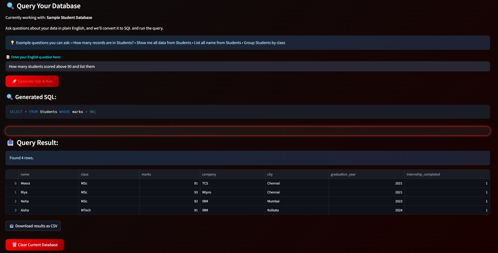

# IntelliSQL

**Query your SQLite database using plain English, powered by Gemini LLM and Streamlit.**

---

## Features

- **Natural Language to SQL:** Ask questions in English; get instant SQL queries and results.
- **Upload Your Database:** Securely upload `.db`, `.sqlite`, or `.sqlite3` files.
- **Dynamic Schema Detection:** Automatically visualizes your database structure (tables, columns, foreign keys).
- **Powered by Gemini 2.0:** Uses Google Gemini LLM for accurate English-to-SQL translation.
- **CSV Export:** Download your query results with one click.
- **Sample Database:** Try the app even without your own database.
- **Modern UI:** Dark theme, neon highlights, and smooth user experience.
- **Privacy First:** Uploaded files are handled as temporary files and never stored on the server.

---

## Demo



---

## Getting Started

### 1. Prerequisites

- Python 3.8+
- [Streamlit](https://streamlit.io/)
- [pandas](https://pandas.pydata.org/)
- [google-generativeai](https://pypi.org/project/google-generativeai/)
- [python-dotenv](https://pypi.org/project/python-dotenv/) (optional, for local API key management)

### 2. Installation

```bash
pip install streamlit pandas google-generativeai python-dotenv
```

### 3. Gemini API Key

- Get your [Google Gemini API key](https://aistudio.google.com/app/apikey).
- Add it to your Streamlit secrets (recommended for Streamlit Cloud):

  ```
  # .streamlit/secrets.toml
  API_KEY = "your-gemini-api-key"
  ```

- Or set it in your environment:

  ```
  export API_KEY=your-gemini-api-key
  ```

### 4. Run the App

```bash
streamlit run app.py
```

---

## Usage

1. **Upload your SQLite database** (`.db`, `.sqlite`, `.sqlite3`).
2. **View your schema:** Expand the schema section to see tables, columns, and relationships.
3. **Ask a question in English:** e.g.,  
   - "Show all students who scored above 90."
   - "How many orders were placed in 2023?"
   - "List unique product categories."
4. **See the generated SQL and results.**
5. **Download results as CSV** if needed.
6. **Try the sample database** if you don't have one.

---

## Data Privacy

> **Your uploaded database is never stored or accessed by the admin.**  
> Files are handled as temporary files and deleted when you clear or end your session.

---

## Project Structure

```
.
├── app.py          # Main Streamlit app
├── data.db         # (Optional) Sample SQLite database
├── .streamlit/
│   └── secrets.toml
└── README.md
```

---

## Technologies Used

- **Streamlit** – Web app framework
- **SQLite** – Database engine
- **Google Gemini LLM** – English-to-SQL translation
- **Pandas** – Data handling and CSV export
- **Custom CSS** – Modern, dark-themed UI

---

## Credits

Built with ❤️ by [Rohith](https://www.instagram.com/rohith_kumar.6/)  
Powered by Streamlit, Gemini LLM, and SQLite.

---

## License

MIT License

---

## Troubleshooting

- **Gemini API errors:** Check your API key and quota.
- **Database errors:** Ensure your file is a valid SQLite database.
- **App not starting:** Check all dependencies are installed and Python version is compatible.

---

## Contributing

Pull requests and suggestions welcome!  
Fork the repo, make your changes, and submit a PR.

---

**Enjoy querying your data the smart way!**